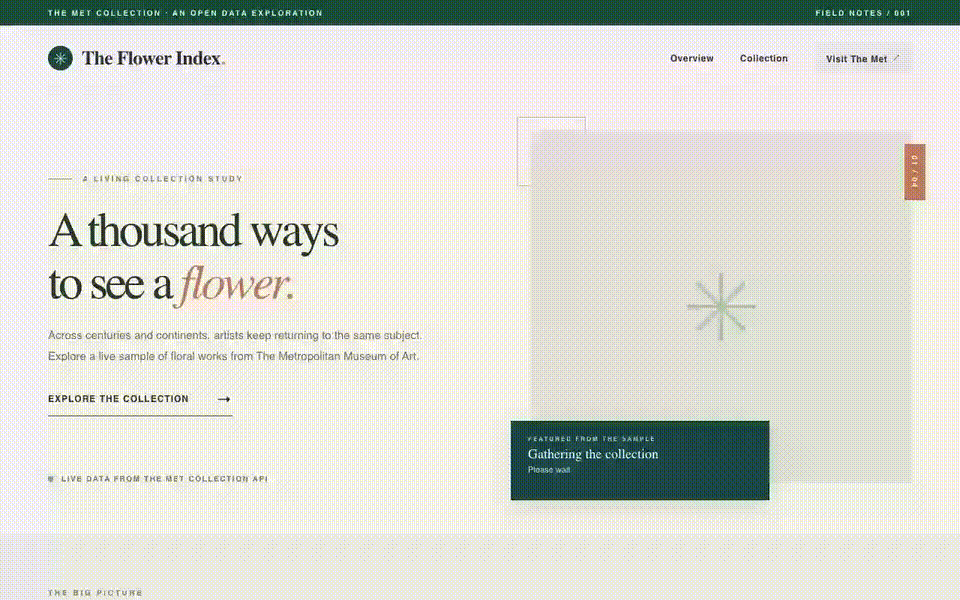

# Web Development Project 5 - The Flower Index

Submitted by **Yudhiishbala Senthilkumar**

This web app explores floral artwork across a live sample of The Metropolitan Museum of Art collection. It shows artwork details, collection statistics, and filters that help visitors compare departments and eras.

Time spent **2 hours** in total

## Required Features

The following **required** functionality is completed.

- [x] The dashboard fetches data from The Met Collection API and displays at least 10 unique artworks, one per row. Each row shows an image, title, maker, department, and date.
- [x] The app fetches data in a React `useEffect` hook using `async` and `await`. Rows are rendered with `.map()`.
- [x] The dashboard shows at least three statistics from the loaded sample. It shows the number of artworks, the number of departments, and the earliest work with the latest date for context.
- [x] A search bar filters the list by artwork title or maker as the user types.
- [x] A department dropdown filters the list by department, a different attribute from the text search.
- [x] The list updates immediately when the search, department, or era filter changes.

The following **optional** features are implemented.

- [x] Search, department, and era filters can be applied at the same time.
- [x] Filters use different input types, including a text input, dropdown, and era buttons.
- [ ] Users can enter their own numeric filter bounds.

The following **additional** features are implemented.

- [x] A department breakdown shows how the live sample is distributed.
- [x] Each artwork links to its source record at The Met.
- [x] A refresh button loads another sample.
- [x] Loading, empty-result, and API error states explain what is happening.
- [x] The dashboard adapts to desktop and mobile screens.

## Video Walkthrough

The walkthrough shows the summary statistics, artwork rows, live text search, department filtering, era filtering, and the department breakdown.

GIF created with Playwright and FFmpeg.

## Notes

The Met search response supplies artwork IDs. The app requests each artwork record to obtain its image, title, maker, department, and date. Some records have no usable image, so the app skips them. The figures describe only the current sample of public collection records and will change when the sample is refreshed.

Run the project with `npm install` and `npm run dev`. Run the data tests with `npm test`. Build it with `npm run build`.

Data source [The Met Collection API](https://metmuseum.github.io/)

## License

Copyright 2026 Yudhiishbala Senthilkumar

Licensed under the Apache License, Version 2.0 (the "License");
you may not use this file except in compliance with the License.
You may obtain a copy of the License at

http://www.apache.org/licenses/LICENSE-2.0

Unless required by applicable law or agreed to in writing, software
distributed under the License is distributed on an "AS IS" BASIS,
WITHOUT WARRANTIES OR CONDITIONS OF ANY KIND, either express or implied.
See the License for the specific language governing permissions and
limitations under the License.
